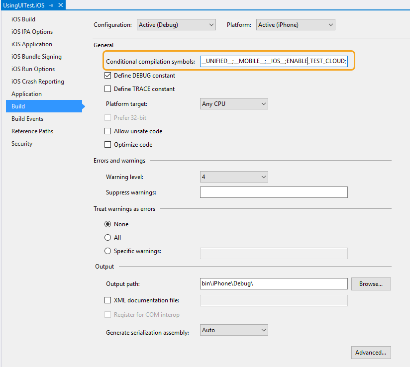
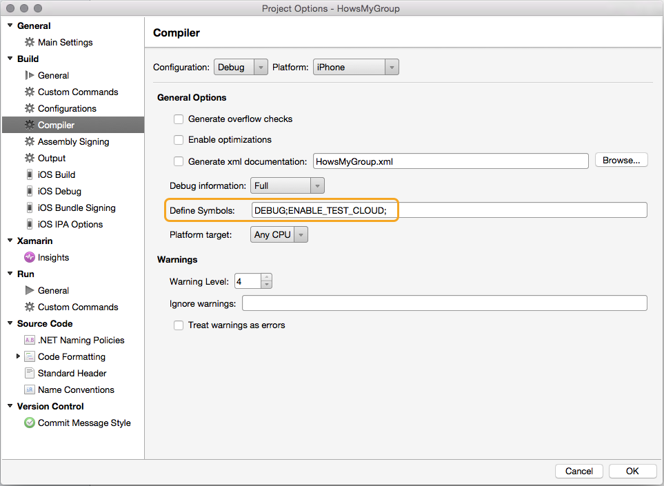
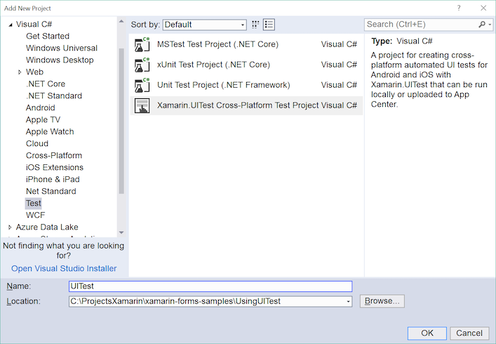
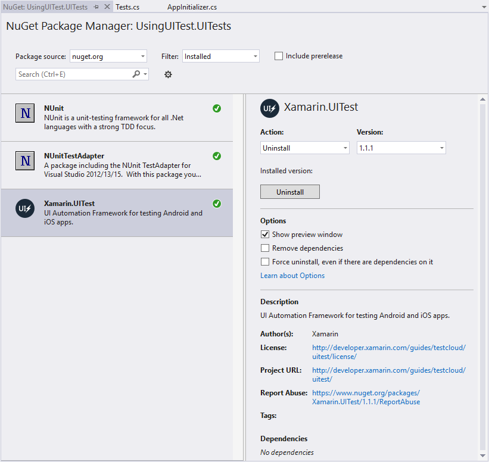
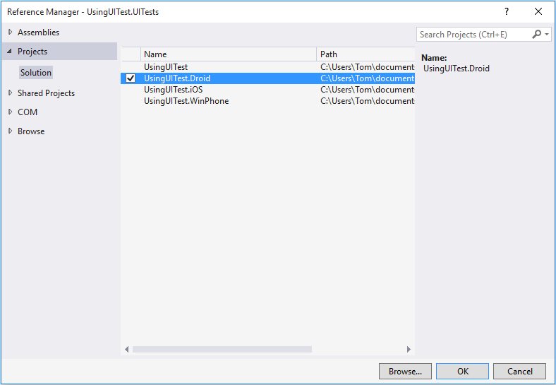
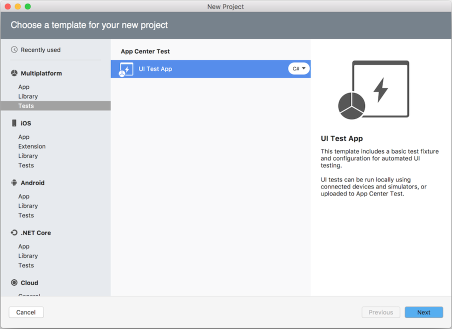
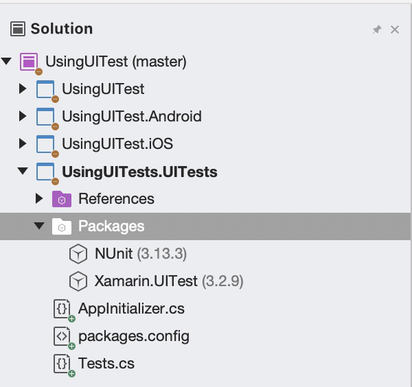
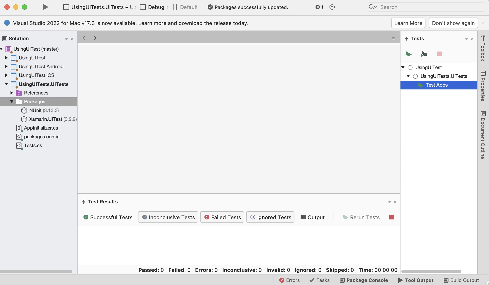
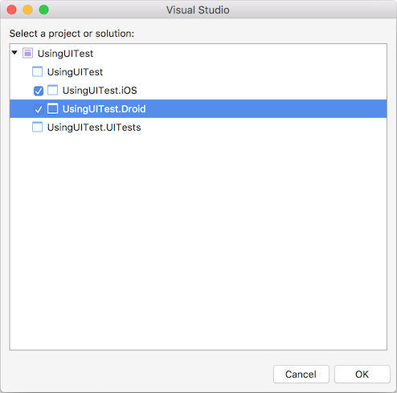
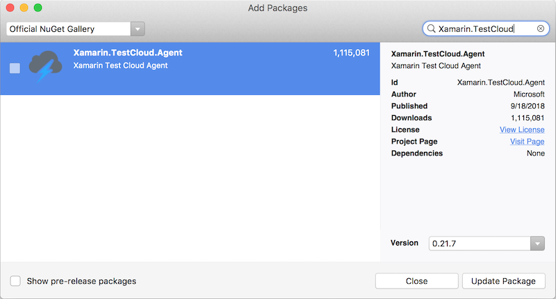

# Get started with UITest and Xamarin.Forms

UITest can be used with Xamarin.Forms to write UI tests to run in the cloud on hundreds of devices.

## Overview

**[App Center Test](~/test-cloud/index.md)** allows developers to write automated user interface tests for iOS and Android apps. With some minor tweaks, Xamarin.Forms apps can be tested using Xamarin.UITest, including sharing the same test code. This article introduces specific tips to get Xamarin.UITest working with Xamarin.Forms.

This guide does assume that familiarity with Xamarin.UITest. The following guides are recommended for gaining familiarity with Xamarin.UITest:

- [Introduction to App Center Test](~/test-cloud/index.md)
- [Introduction to UITest for Xamarin.Android](android/index.md)
- [Introduction to UITest for Xamarin.iOS](ios/index.md)

Once a UITest project has been added to a Xamarin.Forms solution, the steps for writing and running the tests for a Xamarin.Forms application are the same as for a Xamarin.Android or Xamarin.iOS application.

## Requirements

Refer to [Xamarin.UITest](index.md) to confirm your project is ready for automated UI testing.

## Adding UITest support to Xamarin.Forms apps

UITest automates the user interface by activating controls on the screen and providing input anywhere a user would normally interact with the application. To enable tests that can _press a button_ or _enter text in a box_ the test code will need a way to identify the controls on the screen.

To enable the UITest code to reference controls, each control needs a unique identifier. In Xamarin.Forms, the recommended way to set this identifier is by using the [`AutomationId`](/dotnet/api/xamarin.forms.element.automationid) property as shown below:

```csharp
var b = new Button {
    Text = "Click me",
    AutomationId = "MyButton"
};
var l = new Label {
    Text = "Hello, Xamarin.Forms!",
    AutomationId = "MyLabel"
};
```

The [`AutomationId`](/dotnet/api/xamarin.forms.element.automationid) property can also be set in XAML:

```xaml
<Button x:Name="b" AutomationId="MyButton" Text="Click me"/>
<Label x:Name="l" AutomationId="MyLabel" Text="Hello, Xamarin.Forms!" />
```

> [!NOTE] > [`AutomationId`](/dotnet/api/xamarin.forms.element.automationid) is a [`BindableProperty`](/dotnet/api/xamarin.forms.bindableproperty) and so can also be set with a binding expression.

A unique [`AutomationId`](/dotnet/api/xamarin.forms.element.automationid) should be added to all controls that are required for testing (including buttons, text entries, and labels whose value might need to be queried).

> [!WARNING]
> An `InvalidOperationException` will be thrown if an attempt is made to set the [`AutomationId`](/dotnet/api/xamarin.forms.element.automationid) property of an [`Element`](/dotnet/api/xamarin.forms.element) more than once.

### iOS application project

To run tests on iOS, the [Xamarin Test Cloud Agent NuGet package](https://www.nuget.org/packages/Xamarin.TestCloud.Agent/) must be added to the project. Once it's been added, copy the following code into the `AppDelegate.FinishedLaunching` method:

```csharp
#if ENABLE_TEST_CLOUD
// requires Xamarin Test Cloud Agent
Xamarin.Calabash.Start();
#endif
```

The Calabash assembly uses non-public Apple APIs, which cause apps to be rejected by the App Store. However, the Xamarin.iOS linker will remove the Calabash assembly from the final IPA if it isn't explicitly referenced from code.

> [!NOTE]
> By default, release builds don't have the `ENABLE_TEST_CLOUD` compiler variable, which causes the Calabash assembly to be removed from app bundle. However, debug builds do have the compiler directive defined by default, preventing the linker from removing the assembly.

The following screenshot shows the `ENABLE_TEST_CLOUD` compiler variable set for Debug builds:

# [Visual Studio](#tab/windows)



# [Visual Studio for Mac](#tab/macos)



---

### Android application project

Unlike iOS, Android projects don't need any special startup code.

## Writing UITests

For information about writing UITests, see [UITest documentation](index.md).

### Use AutomationId in the Xamarin.Forms UI

Before any UITests can be written, the Xamarin.Forms application user interface must be scriptable. Ensure that all controls in the user interface have a [`AutomationId`](/dotnet/api/xamarin.forms.element.automationid) so that they can be referenced in test code.

#### Referring to the AutomationId in UITests

When writing UITests, the [`AutomationId`](/dotnet/api/xamarin.forms.element.automationid) value is exposed differently on each platform:

- **iOS** uses the `id` field.
- **Android** uses the `label` field.

To write cross-platform UITests that will find the [`AutomationId`](/dotnet/api/xamarin.forms.element.automationid) on both iOS and Android, use the `Marked` test query:

```csharp
app.Query(c=>c.Marked("MyButton"))
```

The shorter form `app.Query("MyButton")` also works.

### Adding a UITest project to an existing solution

# [Visual Studio](#tab/windows)

Visual Studio has a template to help add a Xamarin.UITest project to an existing Xamarin.Forms solution:

1. Right-click on the solution, and select **File > New Project**.
1. From the **Visual C#** Templates, select the **Test** category. Select the **UI Test App > Cross-Platform** template:

   

   This step adds a new project with the **NUnit**, **Xamarin.UITest**, and **NUnitTestAdapter** NuGet packages to the solution:

   

   The **NUnitTestAdapter** is a third-party test runner that allows Visual Studio to run NUnit tests from Visual Studio.

   The new project also has two classes in it. **AppInitializer** contains code to help initialize and setup tests. The other class, **Tests**, contains boilerplate code to help start the UITests.

1. Add a project reference from the UITest project to the Xamarin.Android project:

   

   This step allows the **NUnitTestAdapter** to run the UITests for the Android app from Visual Studio.

# [Visual Studio for Mac](#tab/macos)

It is possible to add a new Xamarin.UITest project to an existing solution manually:

1. Start by adding a new project. Right click on the solution **Add > New Project**. In the **New Project** dialog, select **Multiplatform > Tests > App Center Test > UI Test App**:

   

   This step adds a new project that already has the **NUnit** and **Xamarin.UITest** NuGet packages in the solution:

   

   The new project also has two classes in it. **AppInitializer** contains code to help initialize and setup tests. The other class, **Tests**, contains boilerplate code to help start the UITests.

1. Select **View > Tests** to display the Unit Test pad.

   

1. Right-click on **Test Apps**, click on **Add App Project**, and select iOS and Android projects in the dialog that appears:

   

   The **Unit Test** pad should now have a reference to the iOS and Android projects. This reference allows the Visual Studio for Mac test runner to execute UITests locally against the two Xamarin.Forms projects.

#### Adding UITest to the iOS app

There are some additional changes that need to be done to the iOS application before Xamarin.UITest will work:

1. Add the **Xamarin Test Cloud Agent** NuGet package. Right-click on **Packages**, select **Add Packages**, search NuGet for the **Xamarin Test Cloud Agent** and add it to the Xamarin.iOS project:

   

1. Edit the `FinishedLaunching` method of the project's **AppDelegate** class to initialize the Xamarin Test Cloud Agent when the iOS application starts, and to set the `AutomationId` property of the views. The `FinishedLaunching` method should resemble the following code example:

```csharp
public override bool FinishedLaunching(UIApplication app, NSDictionary options)
{
    #if ENABLE_TEST_CLOUD
    Xamarin.Calabash.Start();
    #endif

    global::Xamarin.Forms.Forms.Init();

    LoadApplication(new App());

    return base.FinishedLaunching(app, options);
}
```

---

After adding Xamarin.UITest to the Xamarin.Forms solution, it's possible to create UITests, run them locally, and submit them to App Center Test.

## Summary

Xamarin.Forms applications can be easily tested with **Xamarin.UITest** using a simple mechanism to expose the [`AutomationId`](/dotnet/api/xamarin.forms.element.automationid) as a unique view identifier for test automation. Once a UITest project has been added to a Xamarin.Forms solution, the steps for writing and running the tests for a Xamarin.Forms application are the same as for a Xamarin.Android or Xamarin.iOS application.

For information about how to submit tests to App Center Test, see [Submitting UITests for Xamarin.Android](android/index.md) or [Submitting UITests for Xamarin.iOS](ios/upload.md). For more information about UITest, see [App Center Test documentation](~/test-cloud/index.md).

## Related links

- [NUnit](http://www.nunit.org)
